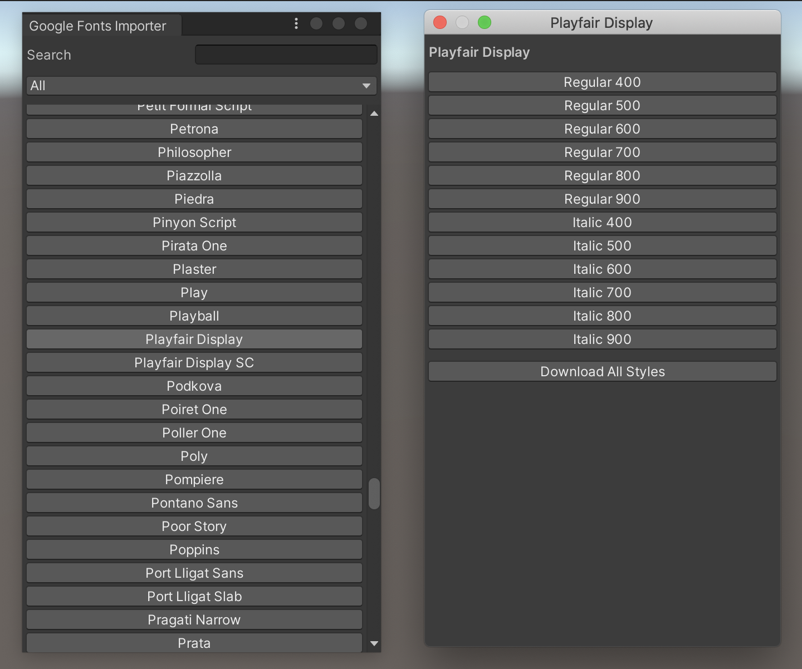

# unity-google-fonts-importer

## Usage

### 1. Add your API key

1. Generate your own API key by following the [Google Fonts Developer API](https://developers.google.com/fonts/docs/developer_api) tutorial.
2. Copy and paste your key in a new text file called `GoogleFontsApiKey.txt`. (The name is important).
3. Create a folder called "Resources" anywhere in your Unity Assets folder.
4. Drag `GoogleFontsApiKey.txt` into your "Resources" folder.

### 2. Download fonts

1. Open the importer from `Google Fonts/Import`.
2. Click on the font you want to import from the list.
    - You can search by name, or select a category to narrow down the list.
3. From the font window, choose the style you want to import.
    - You can also import all available styles.
4. Choose a destination to save it, and press enter.

## Installation

### Via UPM

1. Open Unity `2019` or greater.
2. Open the Package Manager from `Window/Package Manager`.
3. Add a new package from `+/Add package from git url...`.
4. Enter `git@github.com:danielshervheim/unity-google-fonts-importer.git#upm`

### Via `.unitypackage`

1. Download the latest `.unitypackage` from the [Releases](https://github.com/danielshervheim/unity-google-fonts-importer/releases/) page.
2. Open Unity `2018.3` or greater.
3. Import it from `Assets/Import Package/Custom Package`.
